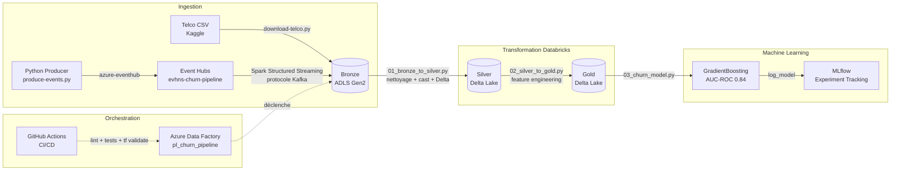
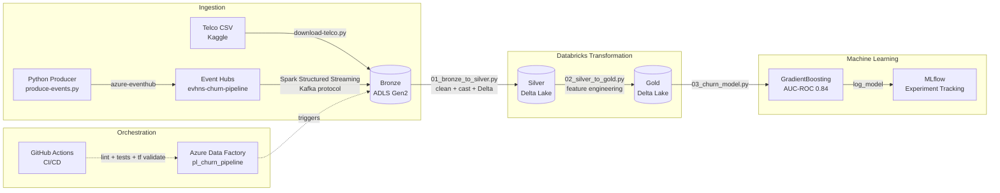

# Customer 360 & Churn Detection Pipeline — Azure


---

## Français

### Contexte business

Ce projet implémente un pipeline data lakehouse end-to-end sur Azure pour la **détection de churn client** dans le secteur des télécommunications.

Deux flux d'ingestion coexistent :

- **Batch** : dataset *Telco Customer Churn* (IBM/Kaggle, 7 043 clients, 21 features) ingéré par script Python
- **Streaming** : événements synthétiques d'usage client produits via un producteur Event Hubs, consommés par Spark Structured Streaming (protocole Kafka)

Les données traversent une architecture Medallion (Bronze → Silver → Gold) stockée sur ADLS Gen2 en format Delta Lake, avant d'alimenter un modèle GradientBoosting suivi avec MLflow. Le pipeline est orchestré par Azure Data Factory et versionné sur GitHub avec CI/CD automatisée.

---

### Architecture



### Architecture Medallion + Delta Lake

| Couche | Chemin ADLS | Contenu |
| ------ | ----------- | ------- |
| Bronze | `bronze/telco/raw/` + `bronze/telco/streaming/` | Données brutes CSV et événements streaming JSON |
| Silver | `silver/telco/customers/` | Données nettoyées, types castés, doublons supprimés, colonnes en snake_case |
| Gold | `gold/telco/features/` | Features engineerées prêtes pour le modèle ML (13 features numériques) |

Delta Lake garantit les transactions ACID, le time travel et le schema enforcement à chaque couche.

---

### Stack technique

| Domaine | Technologies |
| ------- | ------------ |
| Ingestion batch | Python 3.11, `kaggle` API, `azure-storage-blob` |
| Ingestion streaming | `azure-eventhub` (producer), Spark Structured Streaming (consumer, protocole Kafka) |
| Stockage | ADLS Gen2 (HNS activé), Delta Lake, 3 containers Medallion |
| Transformation | PySpark (Databricks DBR 13.3 LTS), nettoyage + feature engineering |
| Machine Learning | `scikit-learn` GradientBoostingClassifier, MLflow tracking & model logging |
| Orchestration | Azure Data Factory (Git integration, trigger hebdomadaire) |
| CI/CD | GitHub Actions : `ruff` lint + `pytest` + `terraform validate` |
| Infrastructure | Terraform (`azurerm ~4.0`, `databricks ~1.0`) |
| Qualité données | Assertions Spark (nulls, unicité customerID, valeurs catégorielles, volume) |
| Tests | `pytest` — 8 tests unitaires sur le producteur Event Hubs |

---

### Structure du dépôt

```text
azure-churn-pipeline/
├── terraform/
│   ├── main.tf                    # Ressources Azure (ADLS, Event Hubs, Databricks, ADF)
│   ├── variables.tf               # Déclaration des variables
│   └── terraform.tfvars           # Valeurs (non commité — .gitignore)
│
├── ingestion/
│   └── scripts/
│       ├── download-telco.py      # Téléchargement Kaggle + upload Bronze
│       └── produce-events.py      # Producteur Event Hubs (100 événements synthétiques)
│
├── databricks/
│   └── notebooks/
│       ├── 00_ingest_telco.py         # Ingestion Kaggle → Bronze (depuis Databricks)
│       ├── 00b_streaming_bronze.py    # Consumer Structured Streaming Event Hubs → Bronze Delta
│       ├── 01_bronze_to_silver.py     # Nettoyage + cast + écriture Silver Delta
│       ├── 02_silver_to_gold.py       # Feature engineering + écriture Gold Delta
│       └── 03_churn_model.py          # GradientBoosting + MLflow tracking
│
├── adf/
│   ├── pipeline/
│   │   ├── pl_ingest_telco.json           # Pipeline ingestion
│   │   ├── pl_transform_databricks.json   # Pipeline transformation (3 notebooks)
│   │   └── pl_churn_pipeline.json         # Pipeline orchestrateur
│   ├── linkedService/AzureDatabricks1.json
│   └── trigger/trigger_weekly_churn.json
│
├── tests/
│   └── test_produce_events.py     # 8 tests unitaires pytest
│
├── steps/                         # How-to détaillés en français
│   ├── 01-terraform.txt
│   ├── 02-ingestion.txt
│   ├── 03-databricks.txt
│   ├── 05-databricks-ml.txt
│   └── 06-adf.txt
│
└── .github/
    └── workflows/
        └── ci.yml                 # CI : lint + tests + terraform validate
```

---

### Lancer le projet

#### Prérequis

- Python 3.11
- [Terraform](https://developer.hashicorp.com/terraform/install) ≥ 1.5
- [Azure CLI](https://learn.microsoft.com/fr-fr/cli/azure/install-azure-cli) ≥ 2.50
- [Databricks CLI](https://docs.databricks.com/dev-tools/cli/install.html)
- Un abonnement Azure actif
- Un compte Kaggle avec token API

#### 1. Provisionner l'infrastructure

```bash
az login
cd terraform
terraform init
terraform apply
```

Récupérer les outputs sensibles :

```bash
terraform output -raw storage_account_key
terraform output -raw eventhub_connection_string
```

#### 2. Configurer les secrets Databricks

```bash
databricks configure   # host + token

databricks secrets create-scope churn-scope
databricks secrets put-secret churn-scope storage-key              --string-value "<STORAGE_KEY>"
databricks secrets put-secret churn-scope eventhub-connection-string --string-value "<EH_CONN_STRING>"
databricks secrets put-secret churn-scope sp-client-id             --string-value "<SP_APP_ID>"
databricks secrets put-secret churn-scope sp-client-secret         --string-value "<SP_PASSWORD>"
databricks secrets put-secret churn-scope sp-tenant-id             --string-value "<TENANT_ID>"
databricks secrets put-secret churn-scope kaggle-username          --string-value "<KAGGLE_USERNAME>"
databricks secrets put-secret churn-scope kaggle-key               --string-value "<KAGGLE_KEY>"
```

#### 3. Ingestion batch locale

```bash
python -m venv venv && source venv/bin/activate
pip install kaggle azure-storage-blob azure-eventhub python-dotenv
cp .env.example .env   # remplir les valeurs

python ingestion/scripts/download-telco.py
python ingestion/scripts/produce-events.py
```

#### 4. Exécuter les notebooks Databricks

Importer les notebooks dans le workspace :

```bash
databricks workspace mkdirs /churn-pipeline
databricks workspace import /churn-pipeline/00_ingest_telco      --file databricks/notebooks/00_ingest_telco.py      --language PYTHON --overwrite
databricks workspace import /churn-pipeline/00b_streaming_bronze --file databricks/notebooks/00b_streaming_bronze.py --language PYTHON --overwrite
databricks workspace import /churn-pipeline/01_bronze_to_silver  --file databricks/notebooks/01_bronze_to_silver.py  --language PYTHON --overwrite
databricks workspace import /churn-pipeline/02_silver_to_gold    --file databricks/notebooks/02_silver_to_gold.py    --language PYTHON --overwrite
databricks workspace import /churn-pipeline/03_churn_model       --file databricks/notebooks/03_churn_model.py       --language PYTHON --overwrite
```

Exécuter dans l'ordre : `00` → `00b` (optionnel) → `01` → `02` → `03`

#### 5. Tests unitaires

```bash
pytest tests/ -v
```

#### 6. Pipeline CI/CD

La CI s'exécute automatiquement sur chaque push vers `main` :

- Job **Lint & Tests Python** : `ruff check ingestion/ tests/` + `pytest tests/ -v`
- Job **Validation Terraform** : `terraform fmt -check` + `terraform init -backend=false` + `terraform validate`

---

### Résultats

| Métrique | Valeur |
| -------- | ------ |
| AUC-ROC GradientBoosting | **0.84** |
| Dataset batch | 7 043 clients, 21 features |
| Features engineerées (Gold) | 13 features numériques |
| Tests unitaires | 8 tests (pytest) |
| Notebooks Databricks | 5 (ingestion + streaming + transformation + ML) |
| Pipelines ADF | 3 (ingest + transform + orchestrateur) |

---

### Aperçu

> *Captures d'écran à ajouter après exécution complète du pipeline.*

| Capture | Description |
| ------- | ----------- |
| `docs/adf_pipeline.png` | Pipeline ADF `pl_churn_pipeline` — vue canvas avec les dépendances |
| `docs/mlflow_run.png` | Run MLflow `gradient-boosting-v1` avec AUC-ROC 0.84 |
| `docs/databricks_notebooks.png` | Liste des notebooks dans le workspace `/churn-pipeline` |
| `docs/github_actions.png` | CI verte — jobs Lint & Tests + Validation Terraform |
| `docs/adls_containers.png` | Containers Bronze / Silver / Gold dans le portail Azure |

---

---

## English

### Business context

This project implements an end-to-end data lakehouse pipeline on Azure for **customer churn detection** in the telecommunications sector.

Two ingestion flows run in parallel:

- **Batch**: *Telco Customer Churn* dataset (IBM/Kaggle, 7,043 customers, 21 features) ingested via Python script
- **Streaming**: synthetic customer usage events produced via an Event Hubs producer, consumed by Spark Structured Streaming (Kafka protocol)

Data flows through a Medallion architecture (Bronze → Silver → Gold) stored on ADLS Gen2 in Delta Lake format, feeding a GradientBoosting model tracked with MLflow. The pipeline is orchestrated by Azure Data Factory and versioned on GitHub with automated CI/CD.

---

### Data pipeline architecture



### Medallion architecture + Delta Lake

| Layer | ADLS Path | Content |
| ----- | --------- | ------- |
| Bronze | `bronze/telco/raw/` + `bronze/telco/streaming/` | Raw CSV data and streaming JSON events |
| Silver | `silver/telco/customers/` | Cleaned data, cast types, deduplicated, snake_case columns |
| Gold | `gold/telco/features/` | Engineered features ready for ML (13 numeric features) |

Delta Lake provides ACID transactions, time travel, and schema enforcement at each layer.

---

### Tech stack

| Domain | Technologies |
| ------ | ------------ |
| Batch ingestion | Python 3.11, `kaggle` API, `azure-storage-blob` |
| Streaming ingestion | `azure-eventhub` (producer), Spark Structured Streaming (consumer, Kafka protocol) |
| Storage | ADLS Gen2 (HNS enabled), Delta Lake, 3 Medallion containers |
| Transformation | PySpark (Databricks DBR 13.3 LTS), cleaning + feature engineering |
| Machine Learning | `scikit-learn` GradientBoostingClassifier, MLflow tracking & model logging |
| Orchestration | Azure Data Factory (Git integration, weekly trigger) |
| CI/CD | GitHub Actions: `ruff` lint + `pytest` + `terraform validate` |
| Infrastructure | Terraform (`azurerm ~4.0`, `databricks ~1.0`) |
| Data quality | Spark assertions (nulls, customerID uniqueness, categorical values, volume) |
| Tests | `pytest` — 8 unit tests on the Event Hubs producer |

---

### Repository structure

```text
azure-churn-pipeline/
├── terraform/
│   ├── main.tf                    # Azure resources (ADLS, Event Hubs, Databricks, ADF)
│   ├── variables.tf               # Variable declarations
│   └── terraform.tfvars           # Values (not committed — .gitignore)
│
├── ingestion/
│   └── scripts/
│       ├── download-telco.py      # Kaggle download + Bronze upload
│       └── produce-events.py      # Event Hubs producer (100 synthetic events)
│
├── databricks/
│   └── notebooks/
│       ├── 00_ingest_telco.py         # Kaggle ingestion → Bronze (from Databricks)
│       ├── 00b_streaming_bronze.py    # Structured Streaming consumer Event Hubs → Bronze Delta
│       ├── 01_bronze_to_silver.py     # Clean + cast + write Silver Delta
│       ├── 02_silver_to_gold.py       # Feature engineering + write Gold Delta
│       └── 03_churn_model.py          # GradientBoosting + MLflow tracking
│
├── adf/
│   ├── pipeline/
│   │   ├── pl_ingest_telco.json
│   │   ├── pl_transform_databricks.json
│   │   └── pl_churn_pipeline.json
│   ├── linkedService/AzureDatabricks1.json
│   └── trigger/trigger_weekly_churn.json
│
├── tests/
│   └── test_produce_events.py     # 8 pytest unit tests
│
├── steps/                         # Detailed French how-to guides
│
└── .github/
    └── workflows/
        └── ci.yml                 # CI: lint + tests + terraform validate
```

---

### Getting started

#### Prerequisites

- Python 3.11
- [Terraform](https://developer.hashicorp.com/terraform/install) ≥ 1.5
- [Azure CLI](https://learn.microsoft.com/en-us/cli/azure/install-azure-cli) ≥ 2.50
- [Databricks CLI](https://docs.databricks.com/dev-tools/cli/install.html)
- An active Azure subscription
- A Kaggle account with API token

#### 1. Provision infrastructure

```bash
az login
cd terraform
terraform init
terraform apply
```

Retrieve sensitive outputs:

```bash
terraform output -raw storage_account_key
terraform output -raw eventhub_connection_string
```

#### 2. Configure Databricks secrets

```bash
databricks configure   # host + token

databricks secrets create-scope churn-scope
databricks secrets put-secret churn-scope storage-key              --string-value "<STORAGE_KEY>"
databricks secrets put-secret churn-scope eventhub-connection-string --string-value "<EH_CONN_STRING>"
databricks secrets put-secret churn-scope sp-client-id             --string-value "<SP_APP_ID>"
databricks secrets put-secret churn-scope sp-client-secret         --string-value "<SP_PASSWORD>"
databricks secrets put-secret churn-scope sp-tenant-id             --string-value "<TENANT_ID>"
databricks secrets put-secret churn-scope kaggle-username          --string-value "<KAGGLE_USERNAME>"
databricks secrets put-secret churn-scope kaggle-key               --string-value "<KAGGLE_KEY>"
```

#### 3. Local batch ingestion

```bash
python -m venv venv && source venv/bin/activate
pip install kaggle azure-storage-blob azure-eventhub python-dotenv
cp .env.example .env   # fill in the values

python ingestion/scripts/download-telco.py
python ingestion/scripts/produce-events.py
```

#### 4. Run Databricks notebooks

Import notebooks into the workspace:

```bash
databricks workspace mkdirs /churn-pipeline
databricks workspace import /churn-pipeline/00_ingest_telco      --file databricks/notebooks/00_ingest_telco.py      --language PYTHON --overwrite
databricks workspace import /churn-pipeline/00b_streaming_bronze --file databricks/notebooks/00b_streaming_bronze.py --language PYTHON --overwrite
databricks workspace import /churn-pipeline/01_bronze_to_silver  --file databricks/notebooks/01_bronze_to_silver.py  --language PYTHON --overwrite
databricks workspace import /churn-pipeline/02_silver_to_gold    --file databricks/notebooks/02_silver_to_gold.py    --language PYTHON --overwrite
databricks workspace import /churn-pipeline/03_churn_model       --file databricks/notebooks/03_churn_model.py       --language PYTHON --overwrite
```

Run in order: `00` → `00b` (optional) → `01` → `02` → `03`

#### 5. Unit tests

```bash
pytest tests/ -v
```

#### 6. CI/CD pipeline

CI runs automatically on every push to `main`:

- **Lint & Tests Python** job: `ruff check ingestion/ tests/` + `pytest tests/ -v`
- **Terraform Validation** job: `terraform fmt -check` + `terraform init -backend=false` + `terraform validate`

---

### Results

| Metric | Value |
| ------ | ----- |
| GradientBoosting AUC-ROC | **0.84** |
| Batch dataset | 7,043 customers, 21 features |
| Engineered features (Gold) | 13 numeric features |
| Unit tests | 8 tests (pytest) |
| Databricks notebooks | 5 (ingestion + streaming + transformation + ML) |
| ADF pipelines | 3 (ingest + transform + orchestrator) |

---

### Screenshots

> *To be added after full pipeline execution.*

| Screenshot | Description |
| ---------- | ----------- |
| `docs/adf_pipeline.png` | ADF pipeline `pl_churn_pipeline` — canvas view with dependencies |
| `docs/mlflow_run.png` | MLflow run `gradient-boosting-v1` with AUC-ROC 0.84 |
| `docs/databricks_notebooks.png` | Notebook list in workspace `/churn-pipeline` |
| `docs/github_actions.png` | Green CI — Lint & Tests + Terraform Validation jobs |
| `docs/adls_containers.png` | Bronze / Silver / Gold containers in Azure portal |
